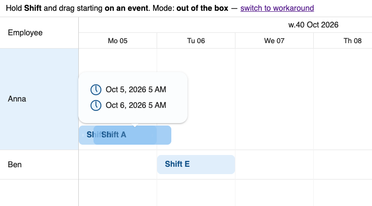
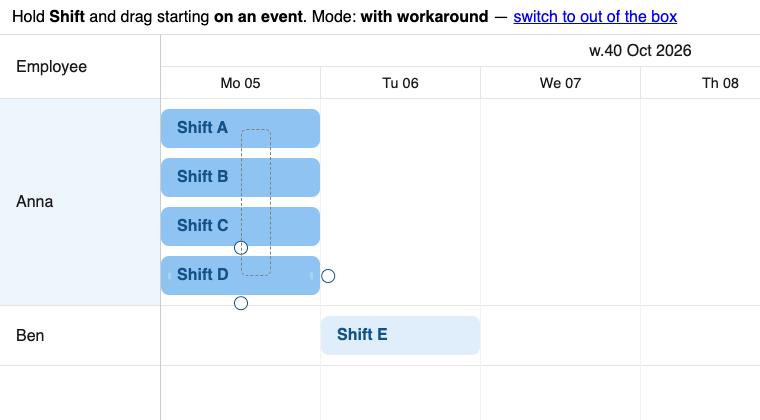

# EventDragSelect: starting the selection on an event

Minimal repro for a question on the Bryntum forum. SchedulerPro 7.3.7, plain JS + Vite.

## Run

```sh
npm install   # needs access to npm.bryntum.com (licensed or trial account)
npm run dev
```

Open the URL Vite prints. `?workaround` in the URL switches the workaround on.

## Steps

1. Hold **Shift**, press on **Shift A** and drag down over Shift B, C and D.
2. Release.

**Out of the box:** Shift A moves with the pointer, nothing gets selected. The drag selection only starts when the mousedown lands on an empty cell, which a busy day barely has.



**With `?workaround`:** the four shifts get selected, nothing moves.



The log under the scheduler also shows:
- `beforeEventDrag` gets `event`, while the docs list `domEvent` (logged as `undefined`).
- The click ending a drag selection still fires `eventClick` / `scheduleClick`. In our app those open a dialog, which then pops over the fresh selection.

## The workaround

See `main.js`: on the first `paint`, `targetSelector` of the EventDragSelect feature gets the event selector appended, and `beforeEventDrag` is vetoed while Shift is held.
